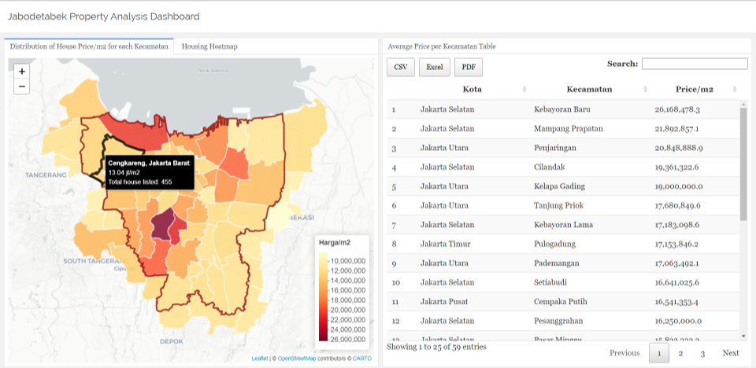

```{r setup, include=FALSE}
# clean up the environment
rm(list = ls())
# setup chunk options
knitr::opts_chunk$set(
  message = FALSE,
  warning = FALSE,
  fig.align = "center",
  class.output = ".scroll-500",
  comment = "#>"
)
options(scipen = 9999)

```


# Preface {.tabset}


## Objectives


This project aims to **provide insight into the conditions of the property market in Jabodetabek**. The data used are the results of a quick sample of ± 10,000 houses offered on one of the marketplace sites in Indonesia in September 2020. The values shown do not necessarily represent the actual prices. This project is modified from Geospatial Analysis in R workshop by Algoritma Data Science School.
  
The final result of this project is a simple Jabodetabek housing dashboard which can be seen **[here](https://rpubs.com/godfriedjunio/jakartapropertydashboard)**. It looks like this:

```{r thematic-map, echo = FALSE, out.width = '100%',fig.align = "center", fig.cap="Snapshot of the final dashboard"}

```

## Library and Setup

In this **Library and Setup** section you’ll see some code to initialize our workspace, and the packages we’ll be using for this project. 

_Packages_ are collections of R functions, data, and compiled code in a well-defined format. The directory where packages are stored is called the _library_. R comes with a standard set of packages. Others are available for download and installation. Once installed, they have to be loaded into the session to be used. 

You will need to use `install.packages()` to install any packages that are not yet downloaded onto your machine. To install packages, type the command below on your console then press ENTER.

```{r eval=FALSE}
## DO NOT RUN CHUNK
# packages <- c("rgdal","sf","tidyverse","glue", "plotly", "maps","leaflet","leaflet.extras", "tmap", "flexdashboard","DT")
# 
# install.packages(packages)
```

Then you need to load the package into your workspace using the `library()` function. Special for this course, the _rmarkdown_ packages do not need to be called using `library()`.

```{r}
# package for data wrangling & vis
library(tidyverse)
library(glue)
library(scales)

# package for spatial environment in R
library(sf)

# package for visualization
library(leaflet)
library(plotly)

```


# Jakarta House Pricing Distribution

## Data Preprocessing

Before starting the analysis, first, we have to read the data:

```{r}
# Read data
df <- read.csv("data/listings.csv")
head(df)
```
We want to compare the house pricing for each sub-district (`Kecamatan`) level. It's better use the price per square meter since the size of the listed properties may vary:

```{r}
# Make a dataframe that shows the house pricing for each sub-district (`Kecamatan`) level
df_agg <- df %>% 
  mutate(
    harga_m2 = harga / m2
  ) %>% 
  group_by(kota, kecamatan) %>% 
  summarise(harga_m2 = median(harga_m2),
            total_listings= n()) %>% 
  ungroup()

head(df_agg)
```

In order to make the data can be displayed in map, we need spatial data. This time I used shapefile of Indonesia provided by [GADM](https://gadm.org/about.html). Indonesia’s spatial vector is provided up to 4 levels of granularity. In this case, we use a level of spatial vector that contains **Kecamatan**. 

Let's read the spatial data, then display it:
```{r}
# Read the spatial data
idn <- st_read(dsn = "shp", layer = "idn")
plot(idn$geometry)
```
Now, we have to join the to the spatial data. This process aims to project our housing data with the geographical information.
```{r}
idn %>% 
  as.data.frame() %>% 
  head()
```
We can do this by joining the information of the city (kota) & sub-district (kecamatan) to NAME_2 & NAME_3 variables respectively in idn. By doing `left join` with `df_agg` as `left_table` the result table will only include the Jabodetabek area (same as df_agg)

```{r}
# Join data
df_agg <- df_agg %>% 
  left_join(idn, by = c("kota" = "NAME_2", "kecamatan" = "NAME_3"))

head(df_agg)
```
Now that our `df_agg` data have the geographic attributes attached, we can turn it into an `sf` object using `st_as_sf()` function:

```{r}
# Modify the data type
df_agg <- st_as_sf(df_agg)

df_agg$geometry
```

## Building Maps


### Distribution of House Price/m2 for each Kecamatan

Now, let's plot the data to the map using [leaflet](https://rstudio.github.io/leaflet/) packages. 


```{r}
# Leaflet
leaflet(df_agg) %>% # create map widget
  addProviderTiles(providers$CartoDB.Positron) %>%  # add basemap
  addPolygons() # add polygons from `sf` data %
```


Now color the polygons based on the house pricing for each kecamatan. First, we need to create a color palette to represent the data. In the chunk below, we create an object called `pal` which stores the colors generated from `df_agg$harga_m2` values. The value passed to fill in `palette` is provided by [ColorBrewer2](https://colorbrewer2.org/#type=sequential&scheme=BuGn&n=3) palettes.

```{r}
pal <- colorNumeric(palette = "YlOrRd", domain = df_agg$harga_m2)

leaflet(df_agg) %>% 
   addProviderTiles(providers$CartoDB.Positron) %>% 
  addPolygons(
    fillColor = ~pal(harga_m2),
    fillOpacity = .8,
    weight = 2,
    color = "white"
  )

```

To make our map more interactive we can add feature like highlight and labels, so as the mouse passes over them, we can see the hover and the details about the sub district (kecamatan). 

```{r}
# Make labels variable for parameter in leaflet
labels <- glue::glue("
  <b>{df_agg$kecamatan}, {df_agg$kota}</b>:<br> {round(df_agg$harga_m2/1e6, 2)} jt/m2 <br> Total house listed: {df_agg$total_listings}"
) %>% lapply(htmltools::HTML)
```

We can add `label` and `highlight` argument inside the `addPolygons()` function.

```{r}
# Add highlight and label to make map more interactive
leaflet(df_agg) %>% 
   addProviderTiles(providers$CartoDB.Positron) %>% 
  addPolygons(
    label = labels,
    fillColor = ~pal(harga_m2),
    fillOpacity = .8,
    weight = 2,
    color = "white",
    highlight = highlightOptions(
      weight = 5,
      color = "black",
      bringToFront = TRUE,
      opacity = 0.8
    )
  )
```

As the final step, we might also need to add a legend to give information about the colors and intervals. To add the legend, we only a layer of `addLegend()` function:

```{r}
leaflet(df_agg) %>% 
   addProviderTiles(providers$CartoDB.Positron) %>% 
  addPolygons(
    label = labels,
    fillColor = ~pal(harga_m2),
    fillOpacity = .8,
    weight = 2,
    color = "white",
    highlight = highlightOptions(
      weight = 5,
      color = "black",
      bringToFront = TRUE,
      opacity = 0.8
    )
  ) %>% 
  addLegend(
    pal = pal,
    values = ~harga_m2,
    opacity = 1,
    title = "Harga/m2",
    position = "bottomright"
  )
```


To separate DKI Jakarta's area with the other area, I create a border. 
```{r}
border  <- df_agg %>% 
  filter(NAME_1 == "Jakarta Raya") %>% 
  group_by(NAME_1) %>% 
  summarise() 
```

Now add the border to the whole code. The full code will look like this:
```{r}

leaflet(df_agg) %>% 
   addProviderTiles(providers$CartoDB.Positron) %>% # using `addProviderTiles()` instead of `addTiles()`
  addPolygons(
    label = labels,
    labelOptions = labelOptions(
      style = list(
        "font-size"="13px",
        "background-color"="black",
        "color"="white"
      )
    ),
    weight = 2,
    color = "white",
    fillOpacity = .8,
    fillColor = ~pal(harga_m2),
     highlight = highlightOptions(
    weight = 5,
    color = "black",
    bringToFront = TRUE,
    sendToBack = TRUE,
    opacity = 0.8)
  ) %>% 
  addPolylines(
    data = border,
    color = "darkred",
    opacity = .8,
    weight = 2.5
  ) %>% 
  addLegend(
    pal = pal,
    values = ~harga_m2,
    opacity = 1,
    title = "Harga/m2",
    position = "bottomright"
  ) 
```

### Housing Heatmap

Now, I create a geographical density map to show the density of housing in Jabodetabek. Before doing that, we have to read the data first:

```{r}
# Read perum data
perum <- read.csv('data/perumahan.csv')
head(perum)
```

The geographical density map is presented using a heatmap: 
```{r}
# Create heatmap
library(leaflet.extras)

leaflet(perum) %>% 
  addProviderTiles(providers$CartoDB.Voyager) %>%
  addCircles(
    label = ~perumahan,
    color = "red"
  ) %>% 
  addHeatmap(
    radius = 10
  )
```

# Publish the Map

An effective way to communicate data visualization is by creating a dashboard. Dashboard helps to communicate information intuitively and essential to support data-driven decision making. The dashboard made using [Flexdashboard](https://rmarkdown.rstudio.com/flexdashboard/) package

[Here](https://rpubs.com/godfriedjunio/jakartapropertydashboard) you can access simple Jabodetabek housing dashboard I created:
[Jabodetabek Property Analysis Dashboard](https://rpubs.com/godfriedjunio/jakartapropertydashboard)


I add a Average Price per Kecamatan Table to the dashboard. The complete `.Rmd` for the dashboard look like this:

````{.scroll-500}
`r paste(readLines('geodashboard_jpa.Rmd'), collapse = '\n')`
````

